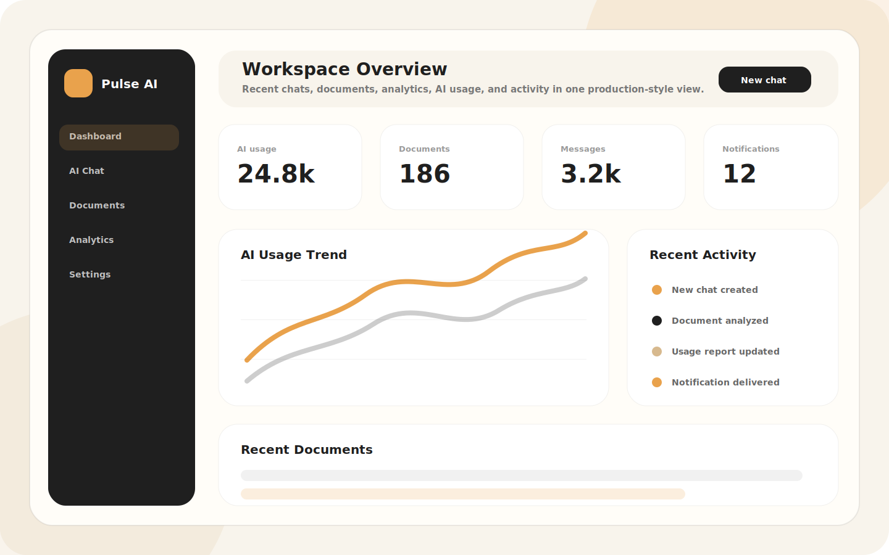
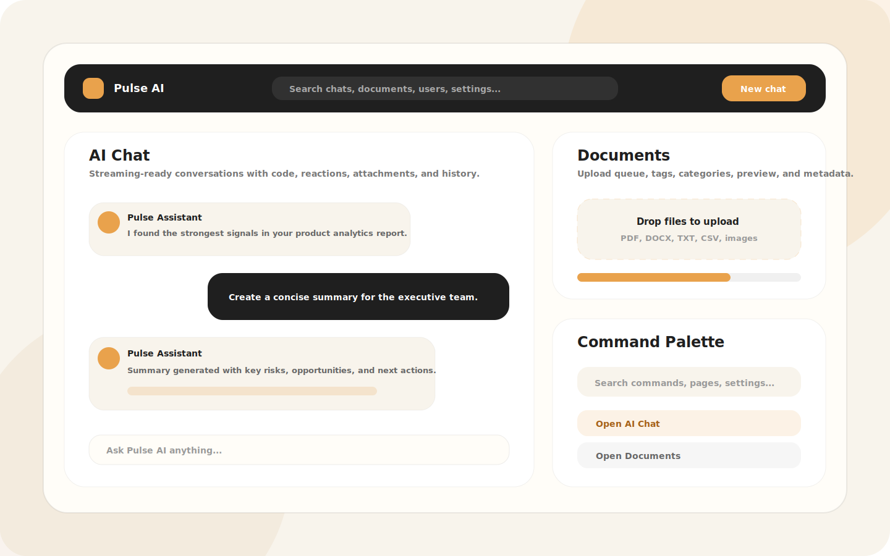

# Pulse AI

<p align="center">
  
</p>

<p align="center">
  <strong>A production-style AI SaaS workspace built for a frontend/full-stack developer portfolio.</strong>
</p>

<p align="center">
  
  
  
  
  
  
</p>

Pulse AI is a polished AI SaaS application that combines a premium React frontend with a production-ready FastAPI backend. It includes AI chat workflows, document management, analytics, global search, notifications, settings, admin tooling, Clerk authentication, MongoDB persistence, PWA support, dynamic SEO, accessibility patterns, and deployment documentation.

This project is designed to be reviewed like a real product: clean architecture, reusable components, professional copy, responsive layouts, error handling, loading states, empty states, route transitions, and clear documentation.

## Screenshots





## Product highlights

- AI chat with conversation history, message actions, reactions, attachments, and streaming-ready UI.
- Document module with upload flow, preview, categories, tags, search, recent documents, and metadata-first storage.
- Analytics dashboard with usage charts, activity timeline, recent chats, recent documents, and user statistics.
- Notification center with unread count, categories, preferences, optimistic actions, context menus, and undo support.
- Global search across chats, messages, documents, users, and settings.
- Admin panel for users, chats, documents, analytics, logs, feedback, roles, permissions, notifications, and settings.
- Reusable design system with buttons, inputs, cards, dialogs, dropdowns, tables, tabs, toasts, skeletons, progress indicators, and empty states.
- PWA behavior with manifest, icons, offline fallback, service worker caching, install prompt, and responsive app shell.
- Professional error handling with 404, 500, offline pages, global error boundary, retry actions, friendly messages, and logging-ready utilities.

## Tech stack

### Frontend

- React 19
- TypeScript
- Vite
- Tailwind CSS
- Clerk React
- TanStack Query
- Axios
- Framer Motion
- Recharts
- Lucide React
- PWA service worker

### Backend

- Python 3.13+
- FastAPI
- Uvicorn
- Pydantic v2
- Motor
- Beanie ODM
- MongoDB Atlas
- Clerk JWT verification
- SlowAPI rate limiting
- Loguru logging
- Docker

### Deployment

- Vercel for frontend
- Render for backend
- MongoDB Atlas for database
- Clerk for authentication

## Architecture

```text
Browser / PWA
  -> Vite React frontend
  -> Clerk session + JWT
  -> FastAPI API gateway
  -> Service layer
  -> Beanie ODM models
  -> MongoDB Atlas
```

Frontend source lives in `src`. Backend source lives in `backend/app`. Detailed architecture is documented in [docs/ARCHITECTURE.md](docs/ARCHITECTURE.md).

## Folder structure

```text
Pulse.AI/
├── backend/
│   ├── app/
│   │   ├── api/v1/
│   │   ├── core/
│   │   ├── db/
│   │   ├── dependencies/
│   │   ├── middleware/
│   │   ├── models/
│   │   ├── providers/
│   │   ├── schemas/
│   │   └── services/
│   ├── tests/
│   ├── Dockerfile
│   ├── docker-compose.yml
│   └── requirements.txt
├── docs/
│   ├── ACCESSIBILITY_AUDIT.md
│   ├── API_DOCUMENTATION.md
│   ├── ARCHITECTURE.md
│   ├── BACKEND_GUIDE.md
│   ├── COMMIT_PLAN.md
│   ├── DEPLOYMENT.md
│   ├── DESIGN_SYSTEM.md
│   ├── FRONTEND_GUIDE.md
│   ├── PORTFOLIO_REVIEW.md
│   ├── PWA_SEO_UX.md
│   └── ROADMAP.md
├── public/
├── src/
│   ├── components/
│   ├── contexts/
│   ├── hooks/
│   ├── layouts/
│   ├── lib/
│   ├── pages/
│   ├── routes/
│   ├── services/
│   ├── styles/
│   ├── types/
│   └── utils/
├── CONTRIBUTING.md
├── README.md
├── render.yaml
└── vercel.json
```

## Quick start

### Frontend

```bash
npm install
cp .env.example .env.local
npm run dev
```

Open:

```text
http://localhost:5173
```

### Backend

macOS / Linux:

```bash
cd backend
python -m venv venv
source venv/bin/activate
pip install -r requirements.txt
cp .env.example .env
uvicorn app.main:app --reload
```

Windows:

```bash
cd backend
python -m venv venv
venv\Scripts\activate
pip install -r requirements.txt
copy .env.example .env
uvicorn app.main:app --reload
```

Open:

```text
http://localhost:8000
```

## Environment variables

Frontend variables are documented in [.env.example](.env.example) and [.env.production.example](.env.production.example).

Backend variables are documented in [backend/.env.example](backend/.env.example) and [backend/.env.production.example](backend/.env.production.example).

Do not commit real Clerk keys, MongoDB credentials, provider keys, or JWT secrets.

## API documentation

The API is versioned under:

```text
/api/v1
```

Core API groups:

- Health
- Auth
- Users
- Conversations
- Messages
- Documents
- Uploads
- Dashboard
- Notifications
- Global search
- Settings
- Admin

Read the complete endpoint reference in [docs/API_DOCUMENTATION.md](docs/API_DOCUMENTATION.md).

## Development commands

### Frontend

```bash
npm run dev
npm run typecheck
npm run build
npm run preview
```

### Backend

```bash
cd backend
pytest
uvicorn app.main:app --reload
```

### Docker backend

```bash
cd backend
docker build -t pulse-ai-api .
docker run --env-file .env -p 8000:8000 pulse-ai-api
```

## Quality checklist

Before sharing the project as a portfolio centerpiece:

- `npm run typecheck` passes.
- `npm run build` passes.
- `pytest` passes in `backend`.
- Landing page has professional copy and no inactive navigation.
- Auth pages render correctly.
- Dashboard routes are responsive.
- Unknown routes show the 404 page.
- Offline and 500 pages render correctly.
- Console is clear during core navigation.
- Environment files contain no real secrets.
- README screenshots load on GitHub.

## Documentation

- [Project architecture](docs/ARCHITECTURE.md)
- [Frontend guide](docs/FRONTEND_GUIDE.md)
- [Backend guide](docs/BACKEND_GUIDE.md)
- [API documentation](docs/API_DOCUMENTATION.md)
- [Deployment guide](docs/DEPLOYMENT.md)
- [Design system](docs/DESIGN_SYSTEM.md)
- [Accessibility audit](docs/ACCESSIBILITY_AUDIT.md)
- [PWA, SEO, and UX guide](docs/PWA_SEO_UX.md)
- [Portfolio review](docs/PORTFOLIO_REVIEW.md)
- [Future roadmap](docs/ROADMAP.md)
- [Professional commit plan](docs/COMMIT_PLAN.md)
- [Contributing guide](CONTRIBUTING.md)

## Deployment

The project includes:

- `vercel.json` for Vercel frontend deployment.
- `render.yaml` for Render backend deployment.
- `backend/Dockerfile` for Dockerized FastAPI deployment.
- Production environment examples for frontend and backend.
- Health checks for API liveness and MongoDB readiness.

Read the full deployment guide in [docs/DEPLOYMENT.md](docs/DEPLOYMENT.md).

## Roadmap

Planned production extensions include:

- Real AI provider activation.
- Cloudinary-backed document asset storage.
- Background document extraction and semantic search.
- Workspace collaboration and invitations.
- CI for frontend build, type checks, and backend tests.
- Billing and usage-based entitlements.
- Enterprise audit and retention controls.

Read the complete roadmap in [docs/ROADMAP.md](docs/ROADMAP.md).

## Contributing

Contribution standards are documented in [CONTRIBUTING.md](CONTRIBUTING.md).

Use Conventional Commits. The recommended development history is documented in [docs/COMMIT_PLAN.md](docs/COMMIT_PLAN.md).

## License

This repository is a portfolio project. Add a license before distributing or accepting external contributions.
